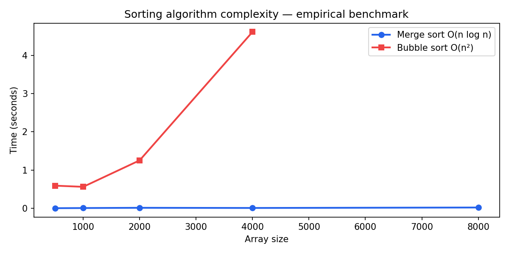

# mitx-6001-algorithms-python

**MITx 6.00.1x — Introduction to Computer Science and Programming in Python**

Algoritmos, estruturas de dados e análise de complexidade — base de engenharia antes de IA e infraestrutura.

---

## Objetivos de estudo

O 6.00.1x estabelece o vocabulário de **complexidade computacional** e **corretude algorítmica** que todo engenheiro de IA precisa. Este repositório cura módulos executáveis: sorting com análise empírica de O(n log n) vs O(n²), OOP aplicada (Scrabble), e criptografia básica. O objetivo é internalizar que escolha de algoritmo não é estética — é **custo de CPU, memória e latência** em escala.

---

## Figuras e interpretação

### Benchmark — sorting



A curva azul (merge sort) cresce quase linearmente em escala log-linear — comportamento O(n log n). A curva vermelha (bubble sort) dispara após n=2000 — O(n²) torna-se impraticável. O cruzamento visual é o argumento que todo CTO precisa internalizar: em pipeline de ETL com 10M registros, a diferença entre O(n log n) e O(n²) é **horas vs dias**. Benchmark empírico complementa prova matemática — essencial quando constantes ocultas (cache, Python overhead) importam.

---

## Módulos

| Módulo | Tópico | Comando |
|--------|--------|---------|
| `sorting/` | Merge, bubble | `python sorting/run.py` |
| `scrabble/` | OOP — Scrabble | `python scrabble/ps4a.py` |
| `cipher/` | Cifra e ataque | `python cipher/ps6.py` |

## Setup

```bash
python docs/generate_figures.py
```

---

## Aprendizados e aplicação no mercado

Algoritmos são a fundação invisível de IA em escala: indexação de embeddings, ordenação de logs, busca em grafos de dependência, deduplicação de alertas. OOP (Scrabble) prepara para arquitetura de agentes com estado; cifra prepara para **segurança de dados em trânsito**. Para AI Engineer/CTO, este repo demonstra que antes de GPU e LLM, há **complexidade assintótica** — e ignorá-la custa dinheiro real em cloud.

---

## Autor

**Guarantã Almeida** — [github.com/guaranta](https://github.com/guaranta)
